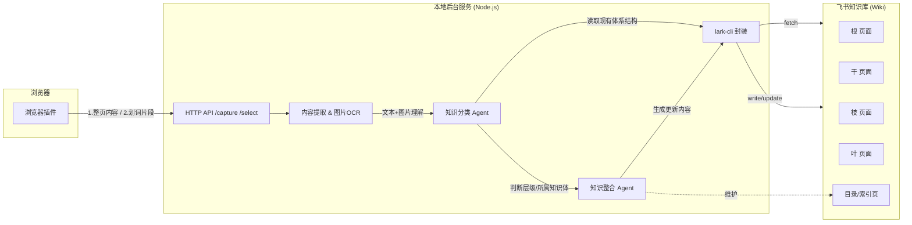

# 知识森林（Knowledge Forest）技术方案设计文档

## Context

用户在日常碎片化阅读（小红书、微信公众号等）中会遇到大量零散但有价值的内容，缺少工具把这些碎片系统地沉淀为结构化知识。用户提出用"树"作比喻：根（最基础/抽象的理论）、干（核心框架）、枝（具体方法/应用）、叶（具体案例/细节）四个粒度，希望借助大模型的理解与总结能力，把新采集到的碎片内容自动归类、并入既有知识体系，而不是简单地把网页内容复制粘贴存档。

本次目标（用户已明确）：**只产出技术方案设计文档，不写代码**。后续实现顺序由用户后续决定。

参考基础：workspace 中已有 `feishu-ai-writer/` 项目，实现了「浏览器插件 + 本地 Node 后端 + lark-cli 封装 + LLM 工具调用循环」的完整技术骨架，本方案将直接复用其中的架构模式和部分代码（尤其是飞书 CLI 封装与插件-后端鉴权机制），而不是从零设计。

## 总体架构



复用 `feishu-ai-writer/backend/`：
- `tools/lark-cli-wrapper.js` 的 `execFile` 调用模式、参数校验方式直接沿用/扩展，新增 wiki 相关命令封装。
- `server.js` 的 Express + SSE + 共享 token 鉴权（`SHARED_TOKEN_PATH`、`X-Extension-Token`）机制复用。
- `llm-client.js` 的本地 LLM 代理调用方式（OpenAI-compatible Responses API + 工具调用循环）复用。

新建独立项目 `knowledge-forest/`（不与 feishu-ai-writer 混合，但可 `require`/复制其 lark-cli 封装模块），结构：

```
knowledge-forest/
  backend/
    server.js              # Express API，两个入口：/capture(整页) /snippet(划词)
    config.js
    llm-client.js           # 复用 feishu-ai-writer 模式
    lark/
      wiki-client.js        # 新增：wiki 页面树的读取/创建/更新封装（基于 lark-cli 或飞书开放API）
    pipeline/
      extract.js            # 文本清洗 + 图片OCR（走LLM多模态理解）
      classify.js           # 判断 根/干/枝/叶 + 归属哪个知识体
      merge.js              # 与既有页面内容合并重写
      toc.js                # 维护目录/索引页
    state/
      capture-log.js        # 记录每次采集的溯源信息（来源URL、原文快照）
  extension/
    manifest.json           # MV3，复用 feishu-ai-writer/extension 结构
    background.js
    content-script.js       # 新增：读取当前页面DOM、监听划词右键菜单
    popup 或 sidepanel        # 展示分类结果/采集状态，允许用户确认/修正层级
```

## 关键设计点

### 1. 浏览器插件：整页 + 划词双入口

- **整页提取**：点击插件图标 → `background.js` 向当前 tab 的 `content-script.js` 请求 `document` 内容（标题、正文 HTML/纯文本、图片 URL 列表、评论区文本），content script 做基础清洗（去广告/导航栏噪声），通过插件后台转发给本地服务。
- **划词/右键菜单**：`chrome.contextMenus` 注册"加入知识森林"菜单项，`chrome.contextMenus.onClicked` 拿到 `info.selectionText`（文字）或 `info.srcUrl`（图片），走同一个后端接口，仅 payload 里 `mode: "snippet"` 与 `mode: "full-page"` 区分。
- 两种入口统一走后端 `/capture` 接口，payload 结构：
  ```json
  {
    "mode": "full-page" | "snippet",
    "sourceUrl": "...",
    "sourceTitle": "...",
    "text": "...",
    "images": ["https://..."],
    "capturedAt": "..."
  }
  ```
- 鉴权沿用 `feishu-ai-writer` 的共享 token 机制（本地 127.0.0.1 场景下的最小化方案，不引入 OAuth）。

### 2. 图片内容提取

- 图片 URL（或插件截图 base64）传给后端，后端调用多模态 LLM 做 OCR + 图片语义描述（不单独接入专门 OCR 服务，直接用大模型能力，降低系统复杂度）。
- 小红书图片可能有防盗链，插件侧优先尝试直接抓取 DOM 内嵌 `` 的 blob/dataURL 而不是仅传 URL，规避后端无 cookie 拉不到图的问题。

### 3. 知识分类与整合：两阶段 Agent 流程

**阶段一：分类（classify.js）**
- 输入：新内容（文本+图片理解结果）+ 知识库当前结构快照（从飞书 wiki 拉取页面树 + 各页面摘要，而非全文，控制上下文体积）。
- LLM 任务：判断新内容属于「根/干/枝/叶」中的哪一级，属于哪个已有知识体（如"心理学"、"投资"），或判断为新知识体的起点。
- 输出结构化 JSON：`{ knowledgeDomain, level, targetPageId | "new", reasoning }`。

**阶段二：整合（merge.js）**
- 输入：分类结果 + 目标页面（或父页面，若新建）当前正文全文。
- LLM 任务：将新内容与旧内容合并重写，保持全文可读、连贯、有条理（不是追加，而是重新组织该页面内容），同时保留必要的溯源信息（可采用页面末尾"来源"小节列出原文链接与采集时间）。
- 输出：该页面的新正文（wiki 富文本/Markdown，视 lark-cli 支持格式而定）。
- 若判断为新知识体或新层级页面：先在 wiki 对应父节点下创建新页面，再写入初始内容，并更新目录页。

**阶段三：目录维护（toc.js）**
- 每次新增/修改页面后，检查目录页是否需要新增条目或调整层级链接，保持目录与实际 wiki 树同步。

### 4. 飞书 Wiki 集成方式

- 采用用户选定的"飞书知识库多层级页面"方案：根/干/枝/叶直接对应 wiki 的页面父子层级（根节点下挂干节点，干节点下挂枝节点，枝下挂叶）。
- 需要扩展 `lark-cli-wrapper.js` 模式，新增：
  - 列出 wiki 空间下的页面树（含 node_token、父子关系、标题）—— 用于阶段一分类时给 LLM 看"目录快照"。
  - 按 node_token 创建子页面。
  - 按 node_token 读取/覆写页面正文。
- 若 `lark-cli` 本身不支持 wiki 相关命令（现有封装仅见 docs 相关命令），需确认 lark-cli 版本能力；如不支持，退化方案是直接调用飞书开放平台 Wiki API（`GET /open-apis/wiki/v2/spaces/:space_id/nodes` 等），复用现有的 `execFile`/校验模式思路，但改为 HTTP 调用飞书开放API（需要 tenant_access_token，走应用凭证）。此处需要在正式实现前先验证 lark-cli 的 wiki 支持情况。

### 5. 幂等性与容错

- 每次采集写入前记录 `capture-log`（来源 URL + 内容哈希），避免同一篇帖子被重复采集处理。
- LLM 合并阶段若判断"与现有内容重复，无新增信息"，允许返回"跳过，无需更新"而不是强行改写。

## 需要在实现前确认/验证的事项

1. `lark-cli` 是否已支持 wiki 空间的节点读取/创建/更新命令（决定是走 CLI 还是直接对接飞书开放 Wiki API）。
2. 飞书知识库的鉴权凭证获取方式（应用 App ID/Secret，或复用 lark-cli 自身已有的登录态）。
3. 图片抓取在小红书/公众号等站点是否有防盗链/登录墙限制，插件侧需要用什么权限（`activeTab` vs 更广的 host_permissions）拿到图片实际内容。
4. 知识体系初始为空时的冷启动策略（首次采集如何创建根节点结构）。

## 验证方式（待进入实现阶段后）

- 单元验证：mock 一批小红书/公众号样例文本+图片，跑通 `extract → classify → merge → toc` pipeline，人工检查分类是否合理、合并后内容是否连贯。
- 端到端验证：真实安装插件，打开一篇小红书帖子，点击插件采集，检查飞书 wiki 对应节点是否正确创建/更新，目录页是否同步。
- 划词场景单独验证：选中某段评论文字，右键采集，确认只提取选中片段而非整页。
